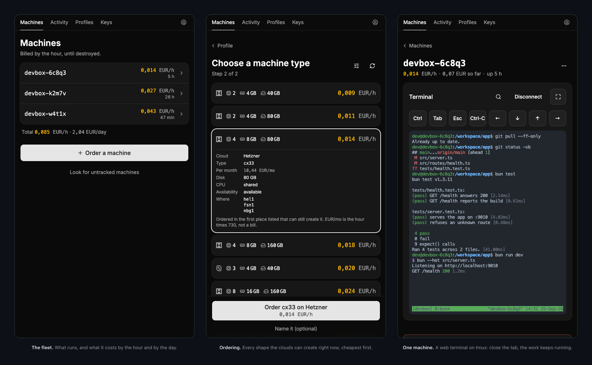

<p align="center">
  <picture>
    <source media="(prefers-color-scheme: dark)" srcset="brand/logo-dark.svg">
    <source media="(prefers-color-scheme: light)" srcset="brand/logo-light.svg">
    
  </picture>
</p>

<p align="center">
  <b>One cloud VM per working session.</b><br>
  Ordered, provisioned and joined over SSH in about five minutes. Destroyed when you are done.
</p>

<p align="center">
  <a href="LICENSE"></a>
  
  
</p>

---

devbox orders the cheapest cloud machine that fits (Hetzner, Scaleway or GCP), sets it up from a
shell script you own, and writes a `Host` block in `~/.ssh/config`, so `ssh <name>` opens the
session with its port forwards. It runs on your laptop and drives Terraform itself. No server,
no account, no subscription.

```console
$ devbox up --profile claude
==> profile claude
==> asking Hetzner what it can create right now
==> ordering cx23 in hel1 at 0,009 EUR/h
==> waiting for sshd on 203.0.113.10:22
==> waiting for phase 1 (toolchain, docker) — 3 to 6 min
==> pushing the secrets into /run/secrets (tmpfs): claude github
==> done in 3 min 12s

$ devbox ls
  NAME           CLOUD    WHERE            SHAPE          PROFILE    EUR/H  EUR/MO  HOST
  devbox-6c8q3   hetzner  hel1             cx23           claude     0,009  6,42    203.0.113.10

  total 0,009 EUR/h, or 0,21 EUR a day and 6,42 EUR a month if they all keep running

$ devbox down
==> devbox-6c8q3 destroyed. Meter stopped.
```

## Install

You need bash, Terraform 1.5 or later, `jq`, `curl`, `nc` and OpenSSH, plus `openssl` for a GCP
service account key. [Bun](https://bun.sh) is optional and draws the terminal UI.

```bash
git clone https://github.com/cthiriet/devbox.git
cd devbox
make key                                   # ~/.ssh/devbox, once, no passphrase
mkdir -p ~/.local/bin
ln -sfn "$PWD/devbox" ~/.local/bin/devbox  # ~/.local/bin must be on your PATH
make cli                                   # optional, needs Bun: the terminal UI
```

Keep the clone: your machines' Terraform state lives in its `tf/` directory. With `make cli`,
`devbox` alone opens a window where `up` asks for a profile, then an offer from every cloud,
cheapest first. In a pipe, with `--json` or with `DEVBOX_PLAIN=1`, output is plain text.

## Add a cloud

Hetzner is the default and the simplest. In its console, create a project used only by devbox
and a Read & Write API token in it, then store the token:

```bash
install -d -m 700 ~/.config/devbox
printf 'Hetzner token: '; read -rs token; echo
printf 'HCLOUD_TOKEN=%s\n' "$token" > ~/.config/devbox/.env.tf; unset token
chmod 600 ~/.config/devbox/.env.tf
devbox probe --cloud hetzner
```

| Cloud | `--cloud` | Needs |
| --- | --- | --- |
| Hetzner | `hetzner` (default) | `HCLOUD_TOKEN` |
| Scaleway | `scaleway` | `SCW_ACCESS_KEY`, `SCW_SECRET_KEY`, `SCW_DEFAULT_PROJECT_ID` |
| GCP | `gcp` | `DEVBOX_GCP_PROJECT`, and a credential |

Scaleway's three variables go in the same file; both clouds read the environment first. GCP
reads `DEVBOX_GCP_PROJECT` from the environment only (export it in your shell profile), and a
service account key at `~/.config/devbox/secrets/gcp` or `$GOOGLE_APPLICATION_CREDENTIALS`, or
else `gcloud auth application-default login`. A cloud without credentials is skipped.

`up` orders the cheapest offer on one cloud: Hetzner, unless you pass `--cloud` or set
`DEVBOX_CLOUD`. `devbox probe` compares all three. Prices are hourly, read from each API on every
call; the monthly column is that times 730 hours, about 17% high on Hetzner. By default machines
are x86 with at least 4 vCPU, 8 GB RAM and 80 GB disk, in Europe (`DEVBOX_HETZNER_LOCATIONS`,
`DEVBOX_SCALEWAY_ZONES` and `DEVBOX_GCP_REGIONS` widen the search).

## Your first machine

```bash
devbox profiles              # what a machine can become, and the secrets each needs
devbox up --profile claude   # order, provision, seed
devbox ssh                   # the session, with its port forwards
devbox down                  # destroy it and stop the meter
```

There is no default profile: `up` refuses to start without `--profile` or `DEVBOX_PROFILE`. The
first `up --profile claude` asks for two secrets, without echoing them, and caches each in
`~/.config/devbox/secrets/<name>` (0600). `claude` is the token that `claude setup-token` prints
on a computer where Claude Code is signed in (an Anthropic API key does not work). `github` is a
fine-grained GitHub token (see [Security](#security)). `opencode` asks for `openrouter`, an
OpenRouter API key, and `github`. The terminal UI asks before ordering; plain mode asks at seed.

`up` works in two phases. Phase 1 is cloud-init: a `dev` user with your key, Docker, git and a
few tools, and no secret. Phase 2 is `devbox seed`: it pushes the profile's secrets over SSH, then
runs the profile. Neither shipped profile clones a repository, so pass
`--repo https://github.com/me/mine.git` or write your own profile. `devbox info` prints the
connection details to type into a phone app.

## Commands

| Command | What it does |
| --- | --- |
| `devbox up` | order and provision a machine. `--profile`, `--repo`, `--cloud`, `--name`, `--min-cpu`, `--min-ram`, `--min-disk`, `--type`, `--no-seed` |
| `devbox seed [name]` | push the secrets and rerun the profile: how you rotate a token. `--profile`, `--repo` |
| `devbox ssh [name]` | open the session through the `Host` block |
| `devbox info [name]` | connection details, written to be typed on a phone. `--json` |
| `devbox ls` | every machine, and what it costs. `--json` |
| `devbox profiles` | every profile, and the secrets it needs. `--json` |
| `devbox probe` | what each cloud can create now, cheapest first. `--cloud`, `--all`, `--min-*`, `--json` |
| `devbox tunnel [name]` | the port forwards without a shell. `--port`, `--close` |
| `devbox orphans` | servers a provider runs that no local state knows about. `--cloud`, `--json` |
| `devbox sync` | with a dashboard: write the `Host` blocks for its machines |
| `devbox down [name]` | destroy the machine, never just stop it. The terminal UI asks first (`--yes` skips); plain mode does not |

The name is optional with one machine; with several, commands refuse to guess. Each machine
(`--name s1`, `--name s2`) gets its own Terraform workspace, `Host` block and local ports: the
app port (the profile's first `devbox-port`, or 9010) goes to local `9010`, then `9011`, and
6443 to `16443`, then `16444`. Extra ports go to the app's local port plus 1000 per rank.

## Profiles

A profile is a shell script with a header that devbox reads. Yours go in
`~/.config/devbox/profiles/<name>.sh` and shadow a shipped one of the same name. Copy
`profiles/claude.sh` there and add a `# devbox-repo:` line to its header, or start from this:

```bash
#!/bin/bash
# devbox-repo:     https://github.com/me/mine.git
# devbox-secrets:  github
# devbox-min-cpu:  4
# devbox-min-ram:  8
# devbox-port:     3000 5173
# devbox-note:     the app is on the first forwarded port
set -euxo pipefail
. /usr/local/lib/devbox/prelude.sh

install_node
clone_repo
as_user "cd $REPO_DIR && npm install"
```

| Header key | Meaning |
| --- | --- |
| `devbox-repo` | cloned by `clone_repo` into `/workspace/<repo>`. `--repo` overrides it |
| `devbox-secrets` | secrets to push to `/run/secrets/<name>`, under any names you like |
| `devbox-min-cpu`, `-min-ram`, `-min-disk` | floors for the order, in vCPU and GB. Flags override them |
| `devbox-port` | ports the app listens on inside, the app first. Each gets a local forward |
| `devbox-note` | one line that `devbox info` prints |

Each key appears once, and its value runs to the end of the line: no comment after it. The
script runs as root, and `seed` reruns it, so make it safe to run twice. It can use the helpers
of [`prelude.sh`](prelude.sh):

| Helper | What it does |
| --- | --- |
| `$USER_NAME` `$HOME_DIR` `$REPO_URL` `$REPO_DIR` | `dev`, `/home/dev`, the repository, `/workspace/<repo>` |
| `as_user "..."`, `step "..."` | run as `dev` in a login shell; print a timed step in the log |
| `require_secrets a b` | stop early when a declared secret is missing |
| `clone_repo [secret] [url] [dir]` | clone once, never over a checkout. An empty secret clones a public repository |
| `git_credentials <host> <secret>` | a git credential for one host only |
| `run_setup <path>` | run a script of the repository as `dev`, from its root |
| `install_node`, `install_chrome`, `install_python`, `install_bun` | Node LTS; Chrome and `chrome-devtools-mcp` (needs Node); uv and its own Python; Bun |
| `install_gh`, `install_claude_code`, `install_opencode` | signed in from `/run/secrets/github`, `claude`, `openrouter` |

## Where your secrets live

On your laptop, all of this is stored in clear text. File permissions are the only protection.

| What | Where | Read first, if set |
| --- | --- | --- |
| Hetzner and Scaleway tokens | `~/.config/devbox/.env.tf`, keep it 0600 | the same variables in the environment |
| GCP key and project | `~/.config/devbox/secrets/gcp`; the project in the environment | `GOOGLE_APPLICATION_CREDENTIALS` |
| Profile secrets | `~/.config/devbox/secrets/<name>`, 0600, typed once | `DEVBOX_<NAME>_TOKEN`, e.g. `DEVBOX_GITHUB_TOKEN` |
| SSH key | `~/.ssh/devbox`, no passphrase | |
| Your profiles | `~/.config/devbox/profiles/` | |
| Your machines | Terraform state in `tf/<cloud>/`, a `Host` block each in `~/.ssh/config` | |

The machine receives your public key through cloud-init, then at seed time the secrets its
profile declares, and nothing else. They land in `/run/secrets/<name>`: tmpfs, mode 0400, owned
by `dev`, gone at reboot until the next `devbox seed`. Anything running as `dev` or root can read
them; the agent needs to. Your cloud tokens and private key never leave your laptop.

## The dashboard (optional)

`dashboard/` is a Bun server that runs the same `devbox-core` on a server of yours.



- Order, watch and destroy machines from a phone, each job with a live log.
- Several accounts, signed in with Google or GitHub, each with its own machines and secrets.
- A web terminal: xterm.js in the page, tmux on the machine. Closing the tab keeps the session.
- Profiles composed in a page from a catalogue, and shared by link.
- Secrets sealed in its database. No page or API sends a value back.

Hosting it takes a Linux x86_64 server, a domain with HTTPS, a Google or GitHub OAuth app, and a
master key kept in a password manager. [docs/deploy.md](docs/deploy.md) walks through it.

To point the CLI at it, create a token on the dashboard's `/account` page, then:

```bash
echo 'DEVBOX_REMOTE=https://devbox.example.com' >> ~/.config/devbox/.env
devbox ls
```

The first command asks for the token and caches it in `~/.config/devbox/secrets/remote`
(`DEVBOX_REMOTE_TOKEN` wins). From then on `up`, `seed` and `down` run on the server, with that
account's clouds, secrets and profiles. `DEVBOX_REMOTE= devbox ls` shows your local machines.
Dashboard machines trust the account's key, kept on the server: `ssh` from your laptop works
only if your `~/.ssh/devbox` is that same pair. Otherwise, use the web terminal.

## Security

- The SSH key has no passphrase, and port 22 is open to the internet, key only. Whoever gets
  `~/.ssh/devbox` gets every machine and its secrets. Narrow the firewall with Terraform's
  `TF_VAR_ssh_source_cidrs` if you always connect from one network.
- Use a cloud project for devbox alone, so a leaked token reaches nothing else.
- `dev` has passwordless sudo, and the `claude` profile lets the agent act without asking.
  Treat the machine as disposable.
- Make the GitHub token fine-grained, limited to the repositories the machine works on, with
  `Contents` and `Pull requests` set to read and write. Permissions are per repository, not per
  branch, so protect `main` with a ruleset whose bypass list is empty.

Found a vulnerability? Report it privately, as [SECURITY.md](SECURITY.md) describes.

## Development

```bash
make test                        # cli/ and dashboard/, with Bun; no test reaches a cloud
cd dashboard && bun run verify   # tests, type checks, and a deployment rehearsal
```

## Contributing

Issues and pull requests are welcome. Profiles are personal: yours belong in
`~/.config/devbox/profiles/`, not here. Defaults must work for any reader, so never commit your
own project ID, domain or token. Comments explain why a line exists, often what broke without
it: keep the reason, or address it, when you change the line. Run `make test` first.

## Licence

[MIT](LICENSE) © Clément Thiriet
